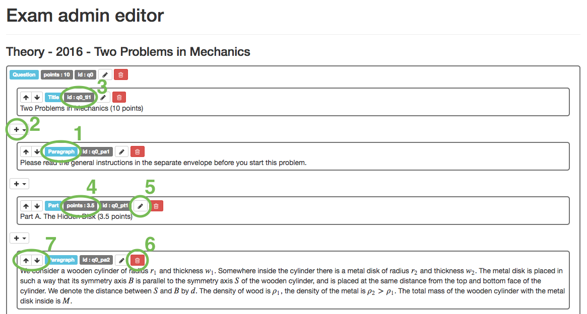
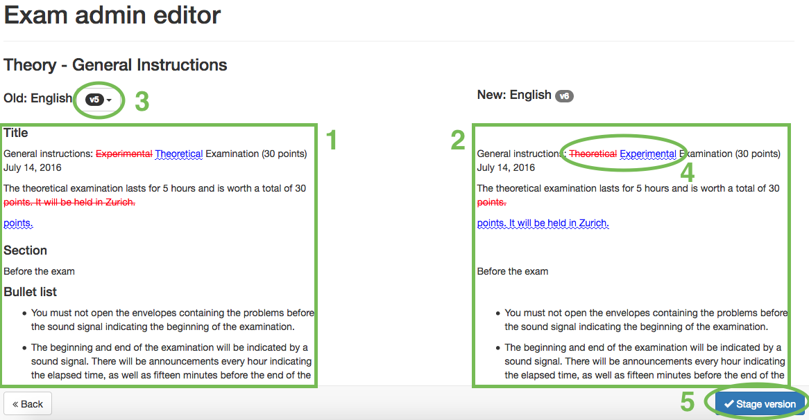

# Admin exam editor

The admin editor is launched from [exam management](admin_exam_management.md) by clicking on the *edit button*. Only versions having status *Proposal* are editable.

## New Question

A new question contains an empty block *Question*. The exam is then constructed by adding different [functional blocks](admin_exam_editor.md#functional-blocks) (e.g. *Subquestion, Paragraph, etc.*) together. Each block can have different child blocks.

### Overview over functionality

* 1 - Name of the block, click [here](admin_exam_editor.md#functional-blocks) for more details about which block does what.
* 2 - Add a new block. Not all blocks may contain all other blocks, for more details see the *valid children* section of the description of each block.
* 3 - Unique id of each block. **IMPORTANT:** never change the id.
* 4 - Number of points in the Question, Part or Subquestion. This information is used for the marking section of the ExamTools.
* If the block has more attributes they are shown here as well.
* 5 - Edit the attributes and the content of the block.
* 6 - Delete the block.
* 7 - Move blocks up and down with respect to each other.

## View PDF
The *View PDF* button shows the compiled version of the question. It is good practice to compile regularly, in order to identify compilation errors as soon as possible.

## Accept
In order to make a question visible to the delegation it has to be accepted. If a version is accepted it can not be changed anymore. To continue working on the question a new version has to be created. When clicking on *Accept* all the changes made are shown and can be revised.

* 1 - Content of the *old* version of the exam.
* 2 - Content of the *new* version that you currently want to accept.
* 3 - Choose the old version (if there is more than one previous one).
* 4 - All changes made between the two versions.
* 5 - *Stage version*, by clicking here the version is accepted and will show up with status *staged* in the [exam management](admin_exam_management.md). This is still not visible to the delegations. To make it visible, all *staged* versions can be published in the *exam management*.

## Functional Blocks
Each block has different attributes that define its properties.
**IMPORTANT:** Do not ever change the attribute "id"!

### Question
Main block of the question. Exists only once.

No block content.

Attributes:

| Key      | Specification                                  |
| -------- | ---------------------------------------------- |
| points   | Total number of points in the whole question.  |

Valid children:
* [Title](admin_exam_editor.md#title)
* [Section](admin_exam_editor.md#section)
* [Part](admin_exam_editor.md#part)
* [Subquestion](admin_exam_editor.md#subquestion)
* [Answer](admin_exam_editor.md#answer)
* [Paragraph like blocks](admin_exam_editor.md#paragraph-like-blocks)
* [Box](admin_exam_editor.md#box)
* [Pagebreak](admin_exam_editor.md#pagebreak)
* [Latex blocks](admin_exam_editor.md#latex-blocks)

### Title

Block content: e.g. "Large Hadron Collider (10 points)". 

No attributes.

No children.

### Section

Block content: e.g. "Linear Acceleration:".

No attributes.

No children.

### Part

Block content: e.g. "Part A. LHC accelerator (6 points)".

Attributes:

| Key      | Specification                                  |
| -------- | ---------------------------------------------- |
| points   | Total number of points in this part.           |

No children.

### Subquestion

No block content.

Attributes:

| Key         | Specification                                  |
| ----------- | ---------------------------------------------- |
| points      | Number of points in subquestion.               |
| part_nr     | Part the subquestion belongs to, e.g "A".      |
| question_nr | Question the subquestion belongs to, e.g "1".  |

Valid children:
* [Paragraph like blocks](admin_exam_editor.md#paragraph-like-blocks)
* [Latex blocks](admin_exam_editor.md#latex-blocks)

### Answer

No block content.

Attributes:

| Key         | Specification                                            |
| ----------- | -------------------------------------------------------- |
| points      | Number of points for the answer.                         |
| part_nr     | Part the answer belongs to, e.g "A".                     |
| question_nr | Question the answer belongs, to e.g "1".                 |
| height      | Define space available to write the answer, e.g. "4 cm". |

Valid children:
* [Paragraph like blocks](admin_exam_editor.md#paragraph-like-blocks)
* [Latex blocks](admin_exam_editor.md#latex-blocks)

### Paragraph like blocks
#### Paragraph

Block content: any text.

No attributes.

No children.

#### Figure

No block content.

Attributes:

| Key         | Specification                                                            |
| ----------- | ------------------------------------------------------------------------ |
| figid       | id referring to figure (see [Figure Management](admin_figure_management.md)).  |
| width       | Multiplier for the width of the figure, default value: "0.9".            |

Valid children:
* [Figure caption](admin_exam_editor.md#figure-caption)
* [Figure text](admin_exam_editor.md#figure-text)

#### Equation

Block content: Latex equation e.g. "I=I_0 - \frac{U}{R_\text{int}}".

No attributes.

No children.

#### Bullet List

No block content.

No attributes.

Valid children:
* [List item](admin_exam_editor.md#list-item)

#### Table

No block content.

| Key         | Specification                                                      |
| ----------- | ------------------------------------------------------------------ |
| width       | Number of columns in table, has to be set if *columns* is not set. |
| top_line    | Number of lines, default: "1".                                     |
| left_line   | Number of lines, default: "1".                                     |
| right_line  | Number of lines, default: "1".                                     |
| grid_line   | Number of lines, default: "1".                                     |
| columns     | Advanced: Used to customize columns, use latex format.             |

Valid children:
* [Table row](admin_exam_editor.md#table-row)
* [Table caption](admin_exam_editor.md#table-caption)

#### Box
Draw box around another block.

No block content.

No attributes.

Valid children:
* [Paragraph like blocks](admin_exam_editor.md#paragraph-like-blocks)
* [Latex blocks](admin_exam_editor.md#latex-blocks)

### Figure Caption

Block content: e.g. "Figure 1: Sketch of an accelerator module."

No attributes.

No children.

### Figure Text

Block content: Text shown in figure, e.g. "transverse plane"

Attributes:

| Key         | Specification                                                                                                   |
| ----------- | --------------------------------------------------------------------------------------------------------------- |
| name        | Name referring to parameter in figure, e.g. "transverse" (see [Figure Management](admin_figure_management.md)). |

No children.

### List item

Block content: Item text.

No attributes.

No children.

### Table row

No block content.

Attributes:

| Key         | Specification                                                      |
| ----------- | ------------------------------------------------------------------ |
| bottom_line | Number of lines, default: "1".                                     |
| multiplier  | Repeat the row n times, default: "1".                             |

Valid children:
* [Table cell](admin_exam_editor.md#table-cell)

### Table Cell

Block content: Cell content.

No attributes.

No children.

### Table Caption

Block content: e.g. "Table 1: Typical numerical values of relevant LHC parameters.".

No attributes.

No children.

### Pagebreak
Start new page.

No block content.

No attributes.

No children.

### Latex Blocks

These are more advanced blocks to create blocks with special properties. If possible this blocks should not be used.

#### Latex replacement template

No block content.

Attributes:

| Key         | Specification                                                      |
| ----------- | ------------------------------------------------------------------ |
| content     | TODO                                                               |

Valid children:
* [Latex replacement parameter](admin_exam_editor.md#latex-replacement-parameter)

#### Latex environment

No block content.

Attributes:

| Key         | Specification                                                      |
| ----------- | ------------------------------------------------------------------ |
| name        | TODO                                                               |

Valid children:
* [Title](admin_exam_editor.md#title)
* [Section](admin_exam_editor.md#section)
* [Part](admin_exam_editor.md#part)
* [Subquestion](admin_exam_editor.md#subquestion)
* [Answer](admin_exam_editor.md#answer)
* [Paragraph like blocks](admin_exam_editor.md#paragraph-like-blocks)
* [Box](admin_exam_editor.md#box)
* [Pagebreak](admin_exam_editor.md#pagebreak)
* [Latex blocks](admin_exam_editor.md#latex-blocks)

### Latex replacement parameter

Block content: TODO

Attributes:

| Key         | Specification                                                      |
| ----------- | ------------------------------------------------------------------ |
| name        | TODO                                                               |

No children.
