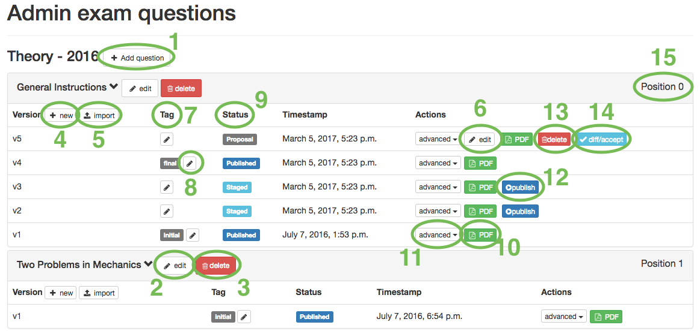

# Admin exam management

## Overview

* 1 - Add a new question to the exam *Theory - 2016*.
* 2 - Edit the question, e.g. Name, Position, Type, etc.
* 3 - Delete a question. Be careful wit this, **all versions and all translations** will be deleted as well.
* 4 - Create a new version of the question, it will contain the content of the last version.
* 5 - Create a new version of the question and upload its content. (see advanced->export)
* 6 - Edit content of the question.
* 7 - The tag is a way to give more information about the version, e.g. *final* or *initial*
* 8 - Edit the tag.
* 9 - There are three status a version can take. A new version has status *Proposal* it can be edited. When *accepting* a version it gets the status *Staged* it is now not editable any more. The make a *Staged* version visible to the delegation it *publish* it and it will get the status *Published*.
* 10 - Download the compiled PDF of the version.
* 11 - Advanced actions:
	* Export: download the raw .xml file. This file can be imported later to a new version node.
	* TeX: show the raw LaTeX of the question.
* 12 - Publish *staged* version to make it visible to the delegations.
* 13 - Delete a version.
* 14 - Accept a version. For more details look  [here](admin_exam_editor.md#accept).
* 15 - The Position attribute to each question is used to order them in the exam.