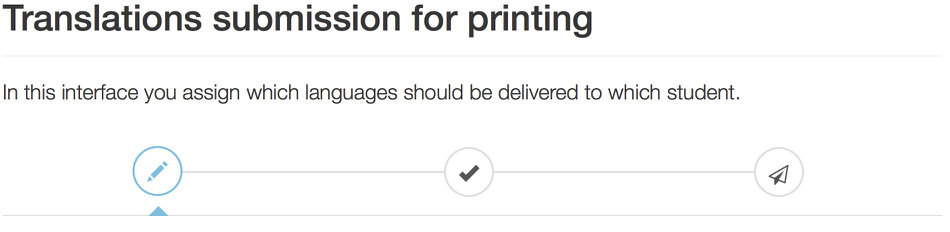
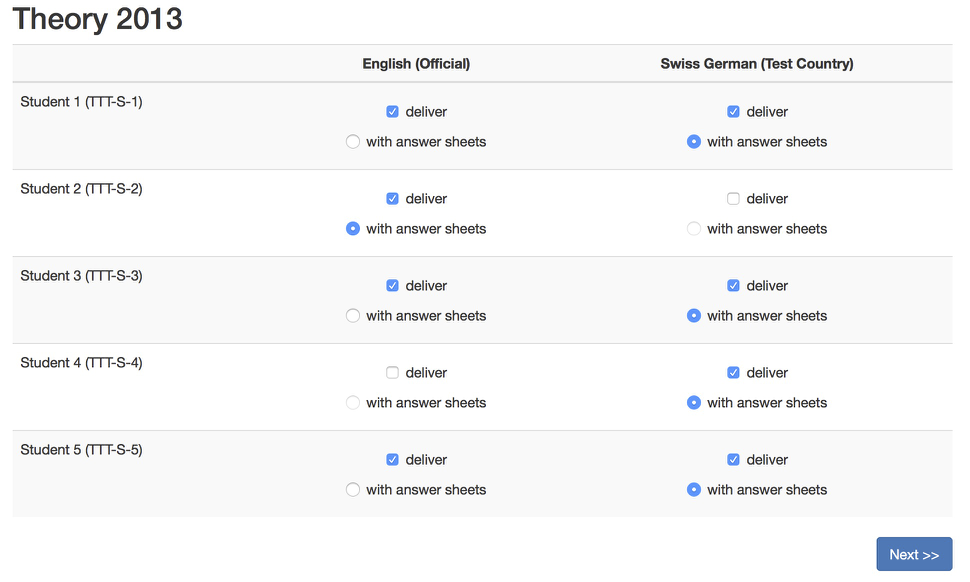
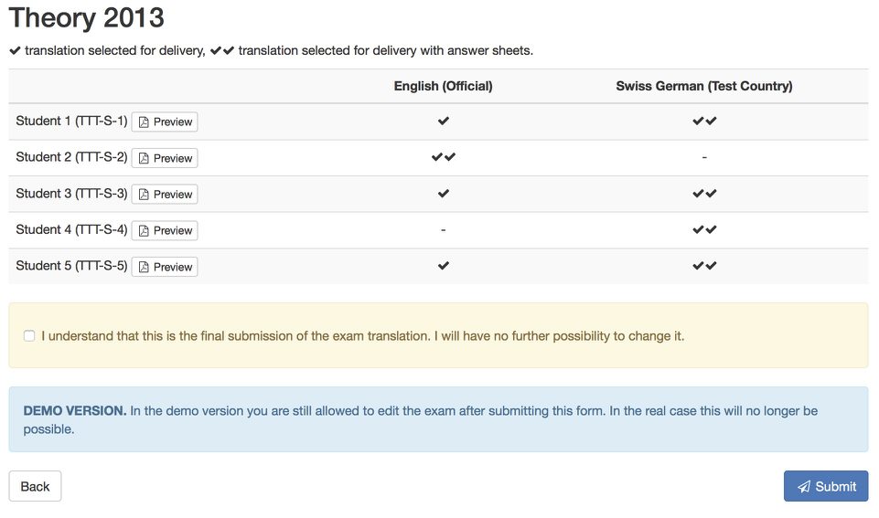

# Assign exams and submit for printing

<figure>
  

      
  

  <figcaption>You can access the submission form from the main navigation menu <em>Exam &gt; Translations &gt; Final submit</em></figcaption>
</figure>

The submission has a few steps. A status bar will guide you through the process: First you **assign languages to participants**, then you will be asked to **confirm** your submission before being being delivered to the organizers for printing.

## Assign exams

In the assign step you select which languages will be printed for each participant. More translations can be develivered, but only one set of answer sheets will be provided, this you have to flag with the select box *with answer sheet*.

If some of your languages does not show up in the table, you probably did not create the translations in the [translations overview](translations.md).

Note that this step is not the final submission, even by clicking *Next* you will be able to come back.

## Confirm and submit for printing

In the second step you see the summary of what has been selected in the previous *Assign step*. For each participant the *Preview* button provides a printable version of the exam, as it will be delivered to the participants. Please review it.

By clicking on the checkbox below the summary table and clicking on *Submit*, you will submit the current selection of translations to the organizers who will take care of printing them and package it for the exam.

Please click on *Submit* only when you are sure about the translations. You will no longer be allowed to modifiy the translations afterwards.

## Summary overview

After the exam has been submitted for printing, you will still be able to review your choices, but no changes are anymore allowed.

Contact the organizers at request-exam@ipho2016.org for further changes and for requesting a scan of the packaged exams.

