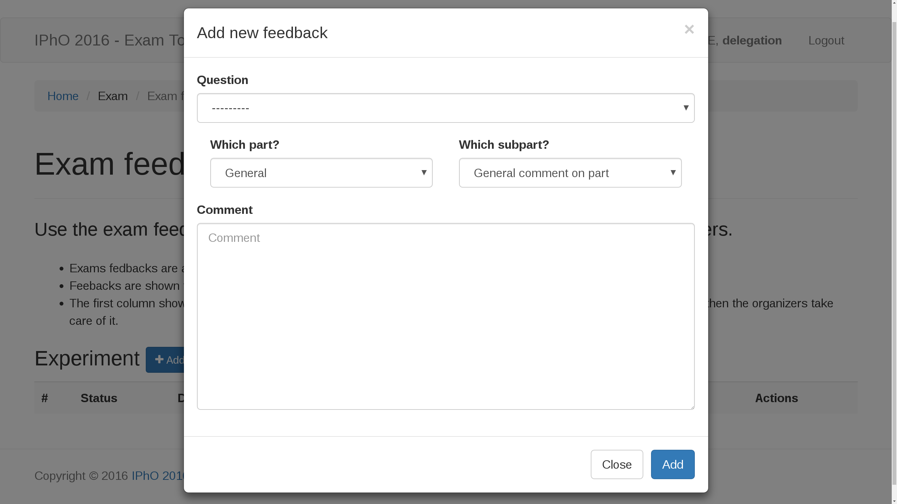
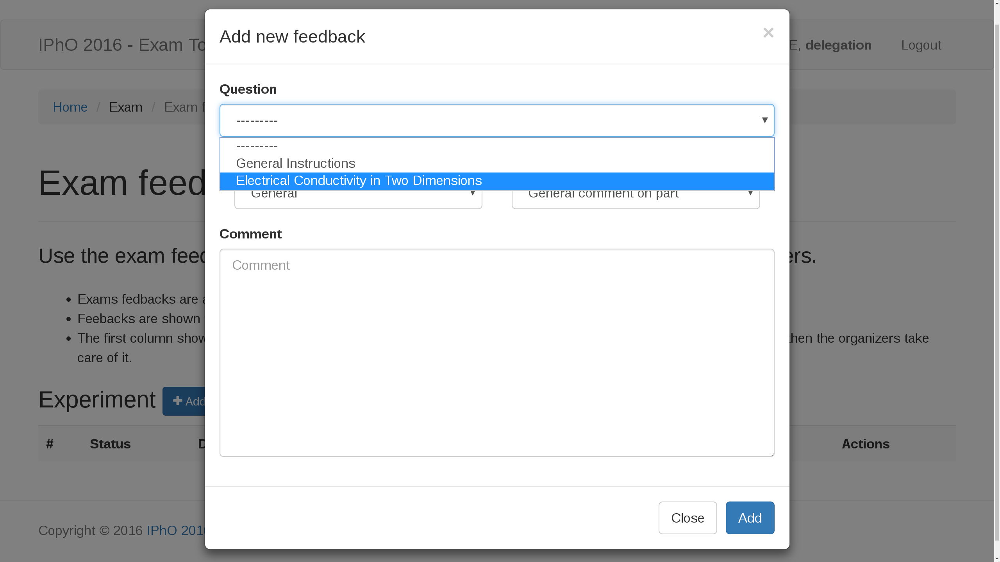
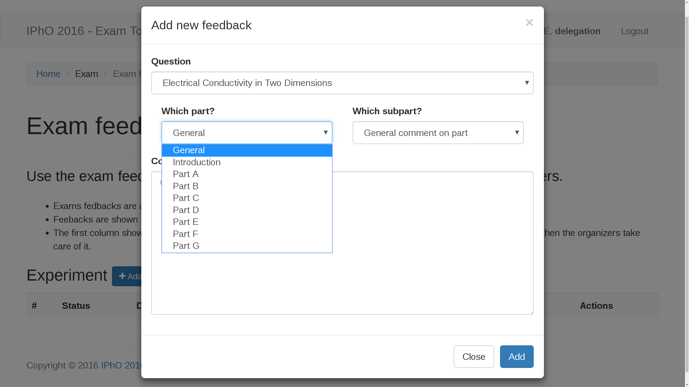
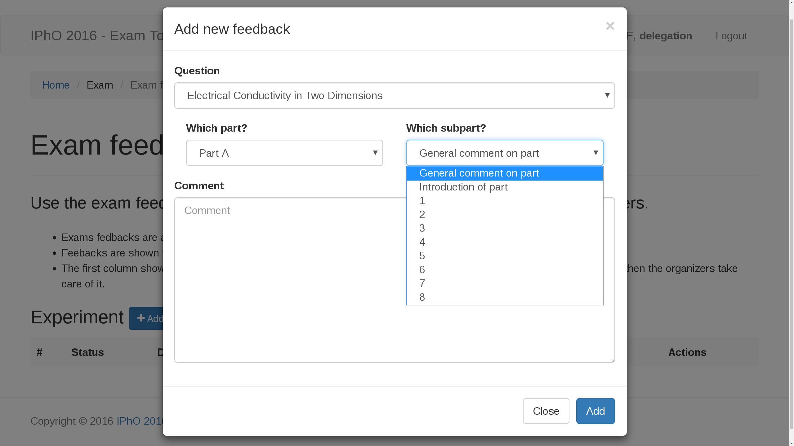

# Exam Feedbacks
Exams feedbacks are enabled after the presentation of the exam questions from the organizers and will be closed when we start the discussions.
Feedbacks will be reviewed by the organizers and are visible to all delegations.
The status will change from **Submitted** to **In progress** and finally to **Resolved**.

## Overview
This is the start page of the Exam Feedback. It can be found in the Exam dropdown menu on the top.Click on *Add feedback* to submitt your own feedback.

A popupmenu appears giving you a range of options to specify the target of your feedback.

Select a question for which you want to give feedback.

Chose the

