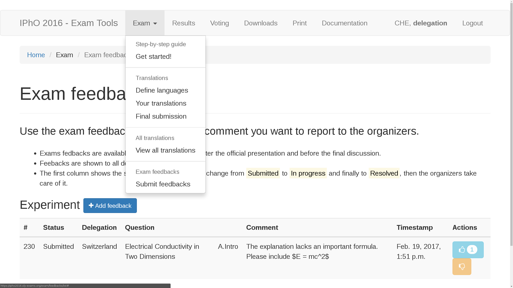

# Exam Feedbacks
Exams feedbacks are enabled after the presentation of the exam questions from the organizers and will be closed when we start the discussions.
Feedbacks will be reviewed by the organizers and are visible to all delegations.

## Get Started
This is the start page of the Exam Feedback. It can be found in the Exam dropdown menu on the top. Click on *Add feedback* to submitt your own feedback.

## Add Feedback

After clicking the *add* button a popupmenu appears giving you a range of options to specify the target of your feedback. Select a question for which you want to give feedback and choose the part and subpart this feedback is related to (The suggestion boxes should be self-explanatory). The closer this specification is related to your question the better the authors will be able to implement changes according to your intentions. Finally write your feedback in the comment box. Be precise and be specific. Word your feedback as a concrete proposition. For example if you think a certain part of a question needs clarification, write down a sentence as you would include it in the final exam.
Finally click the *add* button and a green confimation banner will tell you that your feedback has been added.

|       |  |
|:-------------------------------------------------:|:--------------------------------------------------:|
|     |   |
|  |   |

## Review Feedbacks
All Feedbacks for the currently disscussed exam are visible to everyone. While the leaders prepare feedbacks, the authors can already react to them. Each feedback can have one of four states which is controlled by the organizers:
* **Submitted**: The feedback has successfully been submitted to the server and is now visible to everyone.
* **Scheduled for voting**: This feedback will be partially or entirely part of a voting of the entire board.
* **Implemented**: The changes suggested in this feedback have been included in the exam, either after a voting or after having been accepted by the authors.
* **Settled**: The creator and the authors have come to an agreement that this feedback needs no further pro

Additionaly, you can **like** or **dislike** a feedback. Simply klick either of the *thumbs up* or *thumbs down* buttons in the *Actions* column. If, for example, you see a feedback which makes the same point as you were about to make, you can give this feedback a like instead of submitting your own. This will help the authors decide quickly which feedbacks are important to the most people.