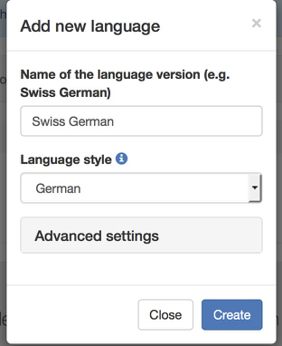

# Language settings

<figure>
  

      
  

  <figcaption>You can access the language settings from the main navigation menu <em>Exam &gt; Translations &gt; Define languages</em></figcaption>
</figure>

## Create a new language
With the *Add language* button one starts the language dialog shown below.

* **Name of the language**: specify the name of the language. The name has to be unique within your delegation.
* **Language style**: For some languages we prepared a preset of advanced settings that should fit your needs. Select the language style which is closer to your needs. Fine tuning is possible within the **Advanced settings**:
    * **Writing direction**: Left-to-right or Right-to-left options are available for tuning the behavior of the web editor.
    * **Polyglossia style**: Polyglossia is a package we use to render the document in printable version. It provides some specialized styles which are aware of indentation conventions, hypenation, etc. Select the option which is close to your language, or leave *English* as a default option. Text direction in the printable version is defined by this setting.
    * **Font in PDF**: We make use of the [Noto fonts](http://www.google.com/get/noto/) which are supposed to cover most of the languages used world-wide. In case you do not find a font which fits your needs, please contact us and we will provide more options.

## Hints for non-roman languages

### Bidi support

In the **web editor** we make use of the *Writing direction* setting to customize the interface.

In the **printable version** one has to set the correct *Polyglossia style* to set the text direction. The following styles are known to be right-to-left:

* Arabic
* Hebrew
* Syriac

### CJK support

Chinese-Japanese-Korean (CJK) languages are supported thanks to the Noto CJK Fonts. For example these fonts:

* *Noto Sans JP* for Japanese
* *Noto Sans KR* for Korean
* *Noto Sans SC* for Simplified Chinese
* *Noto Sans TC* for Traditional Chinese
