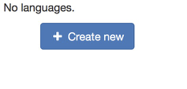
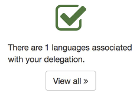
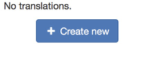
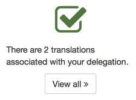
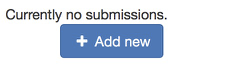
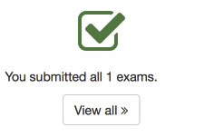

# Step-by-step guide

The step-by-step guide reports the tasks that you already completed and explains how to perfom the next steps in the translation process.

<figure>
  

    
  

  <figcaption>You can access the step-by-step guide from the main navigation menu <em>Exam &gt; Step-by-step guide &gt; Get started!</em></figcaption>
</figure>

## Sections ans status report

### Languages

| Status | Description |
| ------ | ----------- |
|  | No languages for your delegation. Click on the button to be redirected to the [Language settings](language_settings.md). |
|  | One language has been created. Click on *View all* to list all languages. |

### Translations

| Status | Description |
| ------ | ----------- |
|  | No translations are yet been created. Click on the button to be redirected to the [list of translations](translations.md). |
|  | You successfully generated some translations. Click on *View all* to list all your translations. |

### Generate PDF of the exam

In the list of translations (accessible from *2. Translations*) you can click on the PDF button to generate a printable version of the exam questions.

In this step you should check if the printable version contains the right content in the selected languages, e.g. there are no missing symbols.

### Submit for printing

| Status | Description |
| ------ | ----------- |
|  | No submissions are recorded for your delegation. Click on the button to see the overview of submission and start [new submission processes](assign_exams.md). |
|  | You successfully submitted all exams. Click on *View all* to see the overview of submission. |

