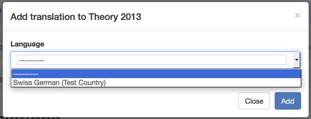

# Your translations

<figure>
  

      
  

  <figcaption>You can access the list of translations from the main navigation menu <em>Exam &gt; Translations &gt; Your translations</em></figcaption>
</figure>

## Overview of translations

On the overview page you can add new translations (a), see (in read-only mode) the official version of the questions (b), edit your translations (c) and see their printable version (d).

## Add new translation

With the *Add translation* you start the translation of an exam in one of your languages. When clicking on the button, you get the following panel.

