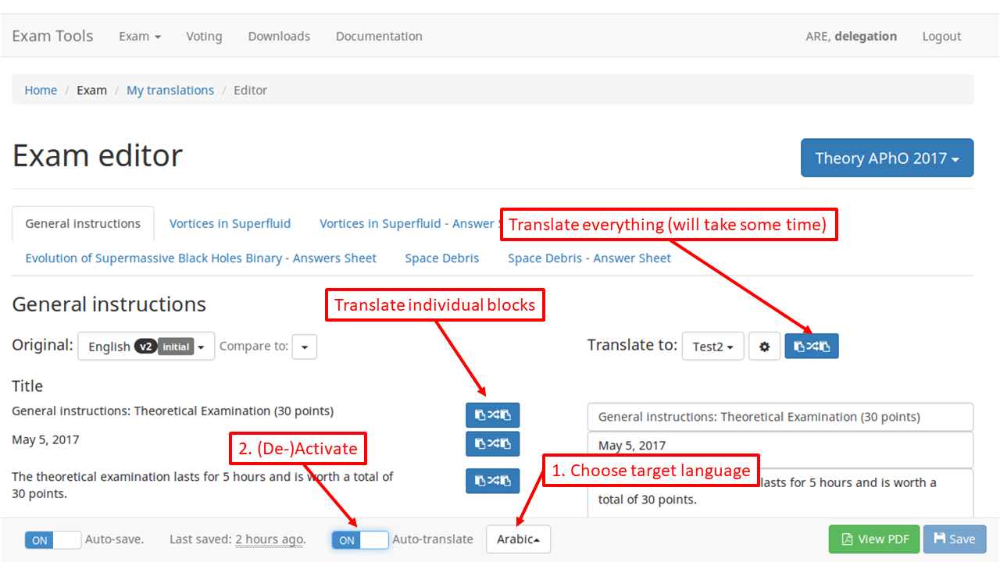

# Exam editor

The exam editor is launched from the [list of your translations](translations.md) by clicking on the *edit button*. In the following figure we review the main components.

## Original content

In the left column you can choose which language you want to translate from. You have the following possibilities:

* One of the official versions. (Difference between original version are also available)
* Any of your languages.
* Any language from the other delegations.

## Translating content

The right column provides a set of text boxes where you can enter the translated version of the block on the left.

Simple blocks as titles only provides a simple text input. Other blocks like text paragraph can be customized more with the options in the toolbars.

## Editor toolbar
### Text styling
The following basic stylings are available:

* Bold
* Italic
* Underline

### Equation editor
Will start a panel for editing equations. Advanced users might also input LaTeX code directly.

### Text direction
Useful for LTR words when editing a RTL language.

### Paragraph text direction
Used to change direction of a whole paragraph.

### Virtual keyboard
For typing a language not corresponding to your keyboard.

## Auto-save

By default your progresses will be automatically saved. This feature can be turned off (or on) using the lower toolbar. Net to the auto-save option you find the timestamp of the last saved version.

At any time one can save the current version with the *Save button*.

##Auto-translate

The auto-translate function can be activated by first choosing a target language and then turn it on using the switch. The copy buttons then transform into translate buttons. Note: this is an new (experimental) feature and we might deactivate it again.

